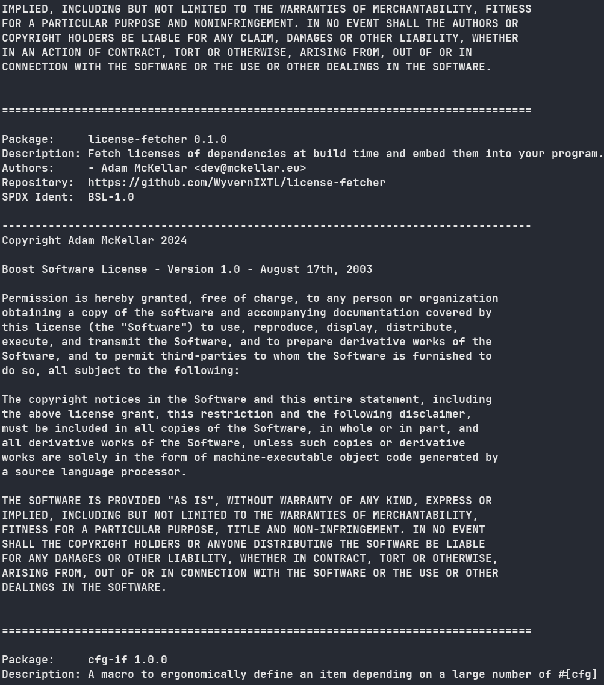

<div align="center">

# `license-fetcher`

**Fetch licenses of dependencies at build time and embed them into your program.**

[](https://crates.io/crates/license-fetcher)
[](https://github.com/WyvernIXTL/license-fetcher/blob/main/LICENSE)
[](https://docs.rs/license-fetcher)
[](https://deps.rs/repo/github/WyvernIXTL/license-fetcher)

</div>

## Aspirations

1. Fetch licenses!
2. Fast!
3. Do it in the build step!

> [!NOTE]
> If you are in search for a cli checkout [flicense](https://github.com/WyvernIXTL/flicense-rs).

## Workings

Crates that are compiled with your program are fetched via `cargo metadata` and `cargo tree`.
License texts are read from the `.cargo/registry/src` folder.
The data is then serialized and compressed.

## Usage

Here is a small rundown how to use this library for fetching licenses during build time.
Though fetching licenses at runtime is also supported. See the docs.

### Include Dependency

> [!WARNING]
> Include this library as build dependency and as normal dependency!

```
cargo add --build --features build license-fetcher
cargo add license-fetcher
```

### Build Script

This library requires you to execute it for fetching licenses in a build script.
Create a file called `build.rs` in the root of your project and add following contents:

```rust
use license_fetcher::build::config::{ConfigBuilder, Config};
use license_fetcher::build::package_list_with_licenses;
use license_fetcher::PackageList;

fn main() {
    // Config with environment variables set by cargo, to fetch licenses at build time.
    let config: Config = ConfigBuilder::from_build_env()
        .build()
        .expect("Failed to build configuration.");

    // Fetch metadata and licenses.
    let packages: PackageList = package_list_with_licenses(config)
                                    .expect("Failed to fetch metadata or licenses.");

    // Write packages to out dir to be embedded.
    packages.write_package_list_to_out_dir().expect("Failed to write package list.");

    // Rerun only if one of the following files changed:
    println!("cargo::rerun-if-changed=build.rs");
    println!("cargo::rerun-if-changed=Cargo.lock");
    println!("cargo::rerun-if-changed=Cargo.toml");
}
```

### Main

Add following content to your `main.rs`:

```rust
use license_fetcher::read_package_list_from_out_dir;

fn main() {
    let package_list = read_package_list_from_out_dir!().unwrap();
}
```

## Alternatives

### [`license-retriever`](https://github.com/MRT-Map/license-retriever)

This project was a big inspiration for license-fetcher.
The idea of fetching licenses during build step did not even occur to me beforehand.

A big shout-out!

#### Pros

- Also retrieves licenses in the build step and loads them into the program.
- Can also use repo url to fetch licenses.
- Can also use spdx to fetch licenses.

#### Cons

- Does not compress licenses.
- LGPL-3.0

### [`cargo-about`](https://github.com/EmbarkStudios/cargo-about)

#### Pros

- Generates very nice html.

#### Cons

- Is not a library to access said data but rather a command line tool.
- Does not fetch licenses from local source files.

## Screenshots

_Display trait included_ 😉


