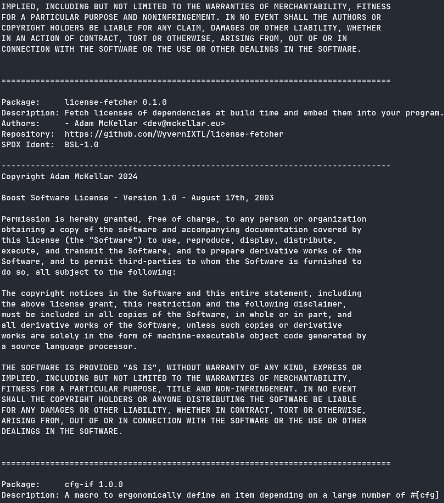

<div align="center">

# `license-fetcher`

**Fetch licenses of dependencies at build time and embed them into your program.**

[](https://crates.io/crates/license-fetcher)
[](https://github.com/WyvernIXTL/license-fetcher/blob/main/LICENSE)
[](https://docs.rs/license-fetcher)
[](https://lib.rs/crates/license-fetcher)
[](https://deps.rs/repo/github/WyvernIXTL/license-fetcher)
[](https://github.com/WyvernIXTL/license-fetcher/actions/workflows/test.yml)
[](https://codecov.io/gh/WyvernIXTL/license-fetcher)
[](https://app.fossa.com/projects/custom%2B44887%2Fgithub.com%2FWyvernIXTL%2Flicense-fetcher?ref=badge_shield&issueType=license)
[](https://app.fossa.com/projects/custom%2B44887%2Fgithub.com%2FWyvernIXTL%2Flicense-fetcher?ref=badge_shield&issueType=security)

</div>

## Aspirations

1. Fetch licenses!
2. Fast!
3. Do it in the build step!

> [!NOTE]
> If you are in search for a CLI checkout [flicense](https://github.com/WyvernIXTL/flicense-rs).

## Workings

Crates that are compiled with your program are fetched via `cargo metadata` and `cargo tree`.
License texts are read from the `.cargo/registry/src` folder.
The data is then serialized and compressed.

## Usage

Here is a small rundown how to use this library for fetching licenses during build time.
Though fetching licenses at runtime is also supported. See the [docs](https://docs.rs/license-fetcher/latest/license_fetcher/build/index.html).

### Include Dependency

> [!WARNING]
> Include this library as build dependency and as normal dependency!

```
cargo add --build --features build license-fetcher
cargo add license-fetcher
```

### Build Script

This library requires you to execute it for fetching licenses in a build script.
Create a file called `build.rs` in the root of your project and add following contents:

```rust
use license_fetcher::build::config::{ConfigBuilder, Config};
use license_fetcher::build::package_list_with_licenses;
use license_fetcher::PackageList;

fn main() {
    // Config with environment variables set by cargo, to fetch licenses at build time.
    let config: Config = ConfigBuilder::from_build_env()
        .build()
        .expect("Failed to build configuration.");

    // Fetch metadata and licenses.
    let packages: PackageList = package_list_with_licenses(config)
                                    .expect("Failed to fetch metadata or licenses.");

    // Write packages to out dir to be embedded.
    packages.write_package_list_to_out_dir().expect("Failed to write package list.");

    // Rerun only if one of the following files changed:
    println!("cargo::rerun-if-changed=build.rs");
    println!("cargo::rerun-if-changed=Cargo.lock");
    println!("cargo::rerun-if-changed=Cargo.toml");
}
```

### Main

Add following content to your `main.rs`:

```rust
use license_fetcher::read_package_list_from_out_dir;

fn main() {
    let package_list = read_package_list_from_out_dir!().unwrap();
}
```


### Much Better Setup With Leniency

I added really great copy-pasta examples in the [`build` module documentation](https://docs.rs/license-fetcher/latest/license_fetcher/build/index.html). Take a look!


## Caveats

`license-fetcher` fetches licenses that are at the root of a package. This results in some caveats, mainly:

- Some projects do not upload licenses with their packages. This might happen if a project is split up into many packages.
- Some wrappers do not attribute the library they are wrapping.
- Dependencies that are not packages, like dictionaries, are not detected.

To work around the former points, it is advisable to use [`flicense --stats .`](https://github.com/WyvernIXTL/flicense-rs) on your package,
to see what packages license-fetcher fetches.

For the latter point there is no workaround, as there is no automated way to detect the use of such dependencies.

## Alternatives

### [`license-retriever`](https://github.com/MRT-Map/license-retriever)

This project was a big inspiration for license-fetcher.
The idea of fetching licenses during build step did not even occur to me beforehand.

A big shout-out!

#### Pros

- Also retrieves licenses in the build step and loads them into the program.
- Can also use repo URL to fetch licenses.
- Can also use SPDX to fetch licenses.

#### Cons

- Does not compress licenses.
- LGPL-3.0

### [`cargo-about`](https://github.com/EmbarkStudios/cargo-about)

#### Pros

- Generates very nice HTML.

#### Cons

- Is not a library to access said data but rather a command line tool.
- Does not fetch licenses from local source files.

## Screenshots

_Display trait included_ 😉




## License

This project is licensed under the [MPL 2.0 license](./LICENSE).


[](https://app.fossa.com/projects/custom%2B44887%2Fgithub.com%2FWyvernIXTL%2Flicense-fetcher?ref=badge_large&issueType=license)

_(* I have no clue, where Fossa is getting those dependencies from 😂)_


## Code Coverage

[](https://codecov.io/gh/WyvernIXTL/license-fetcher)

_Codecov Icicle Graph:_

[](https://codecov.io/gh/WyvernIXTL/license-fetcher)

