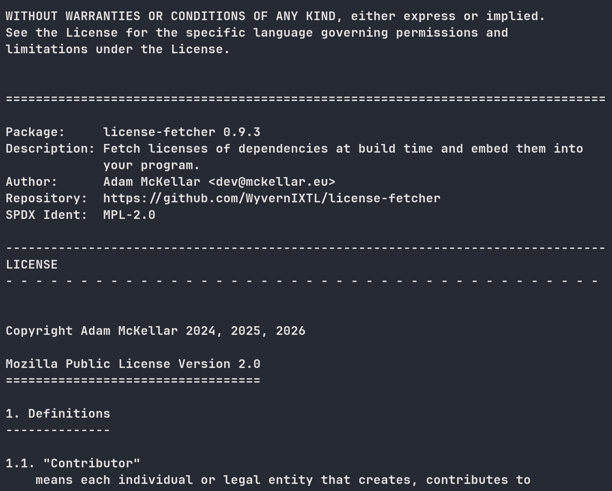
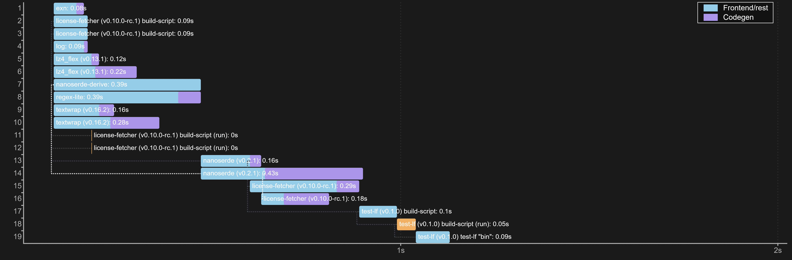

<div align="center">

# `license-fetcher`

**Fetch licenses of dependencies at build time and embed them into your program.**

[](https://crates.io/crates/license-fetcher)
[](https://github.com/WyvernIXTL/license-fetcher/blob/main/LICENSE)
[](https://docs.rs/license-fetcher)
[](https://lib.rs/crates/license-fetcher)
[](https://deps.rs/repo/github/WyvernIXTL/license-fetcher)
[](https://github.com/WyvernIXTL/license-fetcher/actions/workflows/test.yml)
<!--[](https://github.com/WyvernIXTL/license-fetcher/actions)-->
[](https://codecov.io/gh/WyvernIXTL/license-fetcher)

</div>

## Aspirations

1. Fetch licenses!
2. Fast!
3. Do it in the build step!

> [!NOTE]
> If you are in search for a CLI checkout [flicense](https://github.com/WyvernIXTL/flicense-rs).

## Workings

Metadata of packages that are compiled with your program are fetched via `cargo metadata` and `cargo tree`.
License texts are read from the `.cargo/registry/src` folder.
The data is then serialized, compressed and embedded.
At runtime `license-fetcher` has only very few and lightweight dependencies needed for the
decompression, deserialization and pretty print of the license data.

## Usage

Here is a small rundown how to use this library for fetching licenses during build time.
Though fetching licenses at runtime is also supported. See the [docs](https://docs.rs/license-fetcher/latest/license_fetcher/build/index.html).

### Include Dependency

> [!WARNING]
> Include this library as build dependency and as normal dependency!

```
cargo add --build --features build license-fetcher
cargo add license-fetcher
```

### Build Script

This library requires you to execute it for fetching licenses in a build script.
Create a file called `build.rs` in the root of your project and add following contents:

```rust
use license_fetcher::prelude::*;

fn main() {
    // Config with environment variables set by cargo, to fetch licenses at build time.
    let config: Config = ConfigBuilder::from_build_env()
        .build()
        .expect("failed to build configuration");

    let packages: PackageList =
        package_list_with_licenses(&config).expect("failed to fetch metadata or licenses");

    // Write packages to out dir to be embedded.
    packages
        .write_package_list_to_out_dir()
        .expect("failed to write package list");

    // Rerun only if one of the following files changed:
    println!("cargo::rerun-if-changed=build.rs");
    println!("cargo::rerun-if-changed=Cargo.lock");
    println!("cargo::rerun-if-changed=Cargo.toml");
}
```

### Main

Add following content to your `main.rs`:

```rust
use license_fetcher::prelude::*;

fn main() {
    let package_list = read_package_list_from_out_dir!().unwrap();
    println!("{package_list}");
}
```


### Much Better Setup With Leniency

**I added really great copy-pasta examples in the [`build` module documentation](https://docs.rs/license-fetcher/latest/license_fetcher/build/index.html). Take a look!**


## Caveats

`license-fetcher` fetches licenses that are at the root of a package or in subfolders. This results in some caveats, mainly:

- Some projects do not upload licenses with their packages. This might happen if a project is split up into many subpackages.
- Some wrappers do not attribute the library they are wrapping.
- Dependencies that are not packages, like dictionaries, are not detected.

To work around the former points, it is advisable to use [`flicense --stats .`](https://github.com/WyvernIXTL/flicense-rs) on your packages,
to see what licenses license-fetcher fetches.

For the latter point there is no workaround, as there is no automated way to detect the use of such dependencies.

## Alternatives

### [`license-retriever`](https://github.com/MRT-Map/license-retriever)

This project was a big inspiration for license-fetcher.
The idea of fetching licenses during build step did not even occur to me beforehand.

A big shout-out!

#### Pros

- Also retrieves licenses in the build step and embeds them.
- Can use repo URL to fetch licenses.
- Can use SPDX to fetch licenses.
- Smaller and simpler package.

#### Cons

- Does not compress licenses.
- Uses the LGPL-3.0 license. 
  This means that your code also needs to be licenses LGPL-3.0 or compatible as rust links statically by default.
- Has many large dependencies and thus compiles slower.
- No option to disable fetching via git.
- Does not differentiate between dependencies for build and runtime, leading to larger executables with more dependencies.

### [`cargo-about`](https://github.com/EmbarkStudios/cargo-about)

#### Pros

- Can generate very nice HTML.
- Can use repo URL to fetch licenses.

#### Cons

- Is not a library to access said data but rather a command line tool.
  You need to keep the license file up to date (via CI for example).
- If you export and embed the license data as JSON, you need to handle compression, validation and display of it yourself.


## Screenshots

_Display trait included_ 😉



## Performance

I compiled the basic example with timings (`cargo clean && cargo build --release --timings`) on Linux (openSUSE Leap 16) with the Wild linker:



The package build within 1.1s of which 0.05s where spend on the build script with license fetching. This means that **clean builds** (without cache) will be really fast
and incremental builds will take up no time at all (~0.05s).

The full report is available in [`img/timings`](./img/timings).


## License

This project is licensed under the [MPL 2.0 license](./LICENSE).

## Package vs Crate Terminology

- [Docs about this topic](https://doc.rust-lang.org/book/ch07-01-packages-and-crates.html)
- [Reddit comment](https://www.reddit.com/r/rust/comments/lvtzri/comment/gpdti5j/)

I often get confused between these two concepts as they are sometimes used interchangeably.
From what I could gather "package" makes the most sense for license fetcher.
